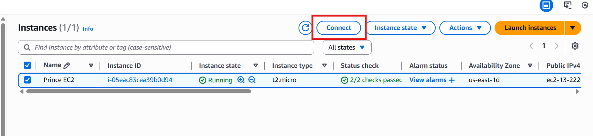

# LAMP STACK IMPLEMENTATION (Linux, Apache, MySQL and PHP)

This document describes the steps used to create a LAMP (Linux, Apache, MySQL and PHP) stack on an AWS EC2 instance. The screenshots taken during the process are included below in the order they were used to perform the setup.

## -Preparing prerequisites 


- I already have an AWS Acccount i use but if you don't please create one while is neccessary for this project.

- Create an EC2 instance in AWS with Ubuntu Server


- Connect your EC2 




- After a successful connection this will be your result as seen in the image below


## STEP 1 — INSTALLING APACHE

- Update a list of packages in package manager

  ```sudo apt update```


- Run apache2 package installation

  ```sudo apt install apache2``` 


- To verify that apache2 is running as a Service in our OS, use following command below, If it is green and running, then you did everything correctly

    ```sudo systemctl status apache2```


- Before we can receive any traffic by our Web Server, we need to open TCP port 80 which is the default port that web browsers use to access web pages on the Internet.... Follow the image below to open TCP port 80 in your EC2


- As seen in the image above, the first step to take is add rule which i numbered as 1, so follow the numbers accordingly and get it done.

- To view the Apache default page, Go to http://Public-IP-Address:80   in your browser, you will see something like the image below


## STEP 2 — INSTALLING MYSQL

-  install the MYSQL software by running the command below, When prompted, confirm installation by typing Y, and then ENTER.

    ```sudo apt install mysql-server```


- When the installation is finished, log in to the MySQL console by typing the command below:

    ```sudo mysql```


- Define the users password using this command:

   ```ALTER USER 'root'@'localhost' IDENTIFIED WITH mysql_native_password BY 'PassWord';```

- Exit the MySQL shell with:

     ```mysql> exit```

- Start the interactive script by running:

    ```sudo mysql_secure_installation```


- When you’re finished, test if you’re able to log in to the MySQL console by typing the command below and enter your password to gain access.

   ```sudo mysql -p```


- To exit the MySQL console, type the command below:

   ```mysql> exit```

## STEP 3 — INSTALLING PHP

- We have Apache installed and MySQL installed to store and manage your data. 
- PHP is the brain behind a website that processes requests and talks to databases before sending results to your browser. In addition to the php package, you’ll need "PHP-MYSQL" ( a PHP module that allows PHP to communicate with MySQL-based databases ) . You’ll also need "lipapache2-mod-php" ( to enable Apache to handle PHP files ). Core PHP packages will automatically be installed as dependencies.

- To install these 3 packages at once, run:

   ```sudo apt install php libapache2-mod-php php-mysql```

   


## STEP 4 — CREATING A VIRTUAL HOST FOR YOUR WEBSITE USING APACHE

- In this project, you will set up a domain called projectflow, but you can replace this with any domain of your choice.

- Create the directory for projectflow using ```mkdir``` command as follows:

  ```sudo mkdir /var/www/projectflow```

- Next, assign ownership of the directory with your current system user by running the command below:

  ```sudo chown -R $USER:$USER /var/www/projectflow```

- create and open a new configuration file in Apache’s sites-available directory using the command below:

  ```sudo vi /etc/apache2/sites-available/projectflow.conf```

- Paste the write up below in the blank space, but first press `i` in your keyboard to enter insert mode, after pasting make sure you save and exit by pressing `esc` and `:wq` the hit `enter` to save the file.

``` 
   <VirtualHost *:80>
    ServerName projectlamp
    ServerAlias www.projectlamp 
    ServerAdmin webmaster@localhost
    DocumentRoot /var/www/projectlamp
    ErrorLog ${APACHE_LOG_DIR}/error.log
    CustomLog ${APACHE_LOG_DIR}/access.log combined
  </VirtualHost>
```
- After pasting the text above it will be come out looking like the image below


- You can now use a2ensite command to enable the new virtual host:

  ```sudo a2ensite projectflow```
- Apache has its own built-in website. If you don’t disable it, Apache may show that site instead of yours. To avoid this problem, disable the default site with a2dissite by running the command below:

  ```sudo a2dissite 000-default```

- To make sure your configuration file doesn’t contain syntax errors, run:

   ```sudo apache2ctl configtest```
if you see "syntax OK" then you good to go


- Finally, reload Apache so these changes take effect by running the command below:

   ```sudo systemctl reload apache2```


## STEP 5 — ENABLE PHP ON THE WEBSITE

- In Apache, the server is set to look for `index.html` before `index.php`. This means that if both files are in the same folder, Apache will show `index.html` first. You can use this to display a temporary maintenance page by creating an `index.html` file with a message for visitors. While this file exists, it will be shown instead of the PHP application. When maintenance is finished, you simply delete or rename the `index.html` file, and Apache will automatically start showing the normal `index.php` page again.

- In case you want to change this behavior, you’ll need to edit the `/etc/apache2/mods-enabled/dir.conf` file and change the order in which the `index.php` file is listed within the `DirectoryIndex` directive. Run the command below:

  ```sudo nano /etc/apache2/mods-enabled/dir.conf```
```
<IfModule mod_dir.c>
        #Change this:
        #DirectoryIndex index.html index.cgi index.pl index.php index.xhtml index.htm
        #To this:
        DirectoryIndex index.php index.html index.cgi index.pl index.xhtml index.htm
</IfModule>
```
- after pasting the text above you will save something like the image below make sure you save and exit.


- After saving and closing the file, you will need to reload Apache so the changes take effect by running this command below:

  ```sudo systemctl reload apache2```

- Finally, we will create a PHP script to test that PHP is correctly installed and configured on your server.
- Create a new file named index.php inside your custom web root folder by running the command below:

   ```vim /var/www/projectlamp/index.php```
This will open a blank file. Add the following text, which is valid PHP code, inside the file:
```
<?php
phpinfo();
```
- When you are finished, save and close the file
- Copy your public ip address and paste it in any of your browser then you will see your PHP just as seen in the image below


