## **LOAD BALANCER SOLUTION WITH NGINX AND SSL/TLS**

- By now you have learned what Load Balancing is used for and have configured an LB solution using Apache, but a DevOps engineer must be a versatile professional and know different alternative solutions for the same problem. That is why, in this project we will configure an [Nginx](https://www.nginx.com/) Load Balancer solution.

- It is also extremely important to ensure that connections to your Web solutions are secure and information is [encrypted in transit](https://security.berkeley.edu/data-encryption-transit-guideline) – we will also cover connection over secured HTTP (HTTPS protocol), its purpose and what is required to implement it.

- When data is moving between a client (browser) and a Web Server over the Internet – it passes through multiple network devices and, if the data is not encrypted, it can be relatively easy intercepted by someone who has access to the intermediate equipment. This kind of information security threat is called [Man-In-The-Middle (MIMT) attack](https://en.wikipedia.org/wiki/Man-in-the-middle_attack)

- This threat is real – users that share sensitive information (bank details, social media access credentials, etc.) via non-secured channels, risk their data to be compromised and used by [cybercriminals.](https://www.trendmicro.com/vinfo/us/security/definition/cybercriminals)

- [SSL and its newer version, TSL](https://en.wikipedia.org/wiki/Secure_Sockets_Layer) – is a security technology that protects connection from MITM attacks by creating an encrypted session between browser and Web server. Here we will refer this family of cryptographic protocols as SSL/TLS – even though SSL was replaced by TLS, the term is still being widely used.

- SSL/TLS uses [digital certificates](https://en.wikipedia.org/wiki/Public_key_certificate) to identify and validate a Website. A browser reads the certificate issued by a [Certificate Authority (CA)](https://en.wikipedia.org/wiki/Certificate_authority) to make sure that the website is registered in the CA so it can be trusted to establish a secured connection.

- There are different types of SSL/TLS certificates – you can learn more about them [here](https://blog.hubspot.com/marketing/what-is-ssl). You can also watch a tutorial on how SSL works [here](https://youtu.be/T4Df5_cojAs) or an additional resource [here](https://youtu.be/SJJmoDZ3il8)

- In this project you will register your website with [LetsEnrcypt](https://letsencrypt.org/) Certificate Authority, to automate certificate issuance you will use a shell client recommended by LetsEncrypt – [cetrbot.](https://certbot.eff.org/)

### **Task**

- This project consists of two parts:

1. Configure Nginx as a Load Balancer
2. Register a new domain name and configure secured connection using SSL/TLS certificates. 

- Your target architecture will look like this:

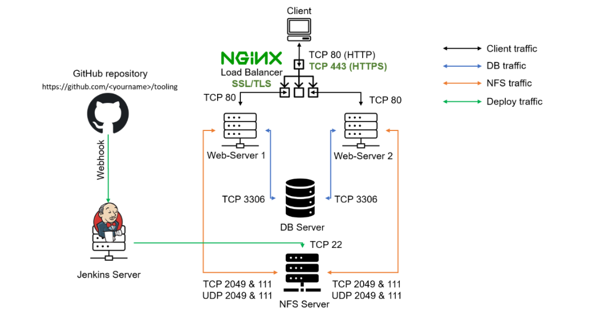


## **CONFIGURE NGINX AS A LOAD BALANCER**


- Create an EC2 VM based on Ubuntu Server 20.04 LTS and name it ``Nginx LB`` (do not forget to open TCP port 80 for HTTP connections, also open TCP port 443 – this port is used for secured HTTPS connections)

- Update ``/etc/hosts`` file for local DNS with Web Servers’ names (e.g. **Web1** and **Web2**) and their local IP addresses

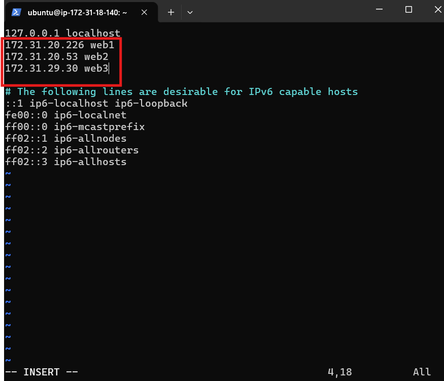

- Install and configure Nginx as a load balancer to point traffic to the resolvable DNS names of the webservers


- Update the instance and Install Nginx: 
```
sudo apt update
sudo apt install nginx
```
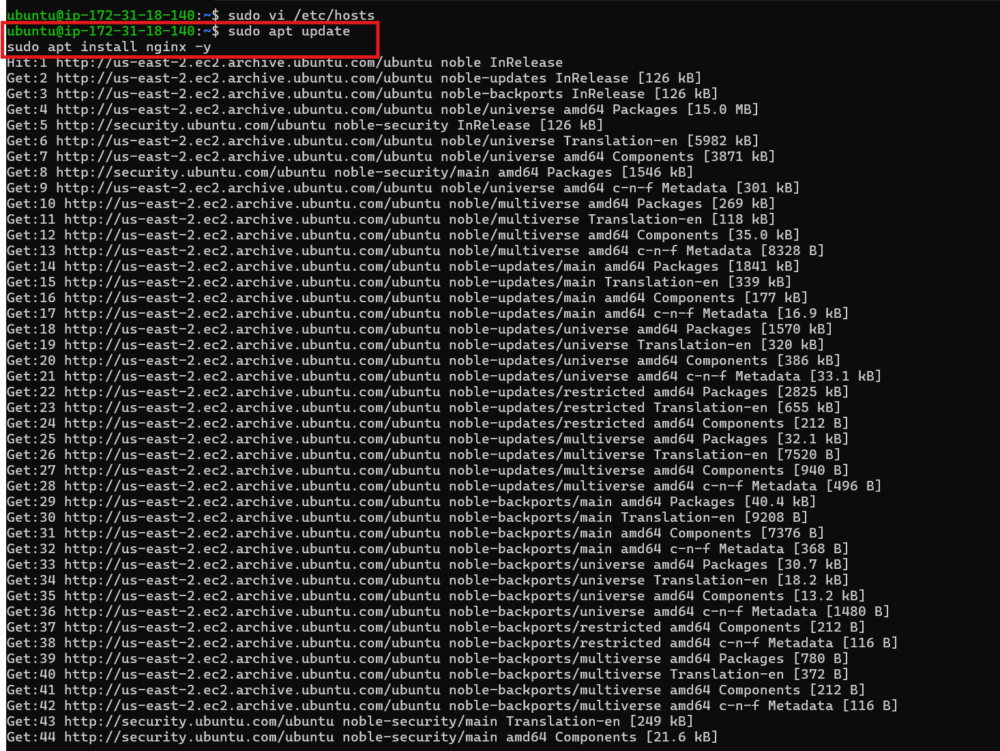

- Configure Nginx LB using Web Servers’ names defined in ``/etc/hosts``
**Hint:** Read this [blog](https://linuxize.com/post/how-to-edit-your-hosts-file/) to read about ``/etc/host``

- Open the default nginx configuration file :
``sudo vi /etc/nginx/nginx.conf``
```
 upstream myproject {
    server Web1 weight=5;
    server Web2 weight=5;
  }


server {
    listen 80;
    server_name www.domain.com;
    location / {
      proxy_pass http://myproject;
    }
  }


#comment out this line
#       include /etc/nginx/sites-enabled/*;
```

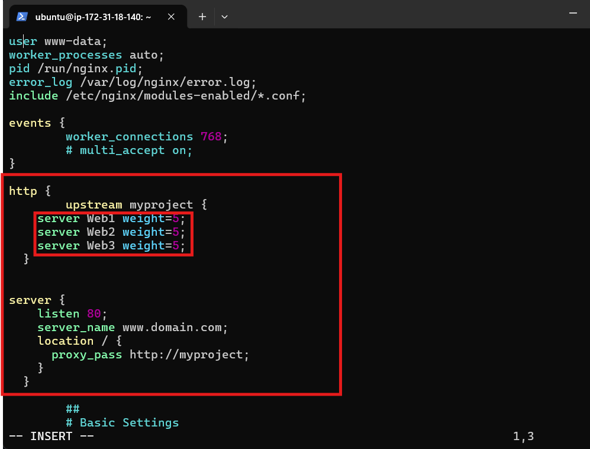

- Restart Nginx and make sure the service is up and running: 
```
sudo systemctl restart nginx
sudo systemctl status nginx
```
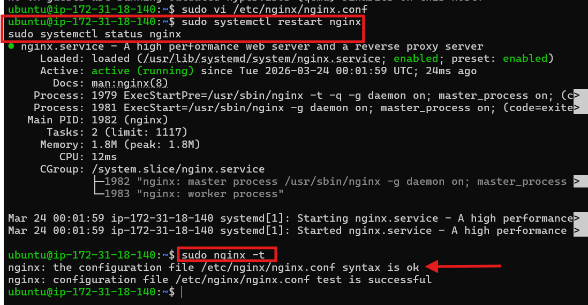


## REGISTER A NEW DOMAIN NAME AND CONFIGURE SECURED CONNECTION USING SSL/TLS CERTIFICATES
- Let us make necessary configurations to make connections to our Tooling Web Solution secured!
In order to get a valid SSL certificate – you need to register a new domain name, you can do it using any [Domain name registrar](https://en.wikipedia.org/wiki/Domain_name_registrar) – a company that manages reservation of domain names. The most popular ones are: [Godaddy.com](https://godaddy.com/), [Domain.com](https://www.domain.com/), [Bluehost.com](https://www.bluehost.com/).

1. Register a new domain name with any registrar of your choice in any domain zone (e.g. **.com, .net, .org, .edu, .info, .xyz** or any other)

2. Assign an Elastic IP to your Nginx LB server and associate your domain name with this Elastic IP

-  You might have noticed, that every time you restart or stop/start your EC2 instance – you get a new public IP address. When you want to associate your domain name – it is better to have a static IP address that does not change after reboot. Elastic IP is the solution for this problem, learn how to allocate an Elastic IP and associate it with an EC2 server on this page.

- Update A record in your registrar to point to Nginx LB using Elastic IP address

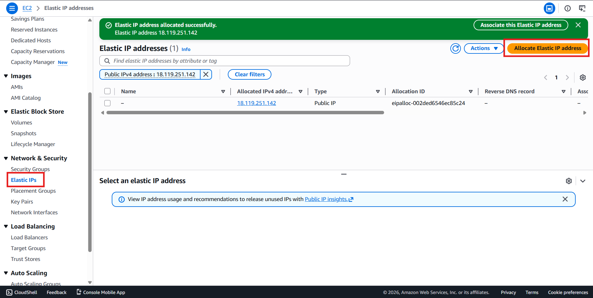

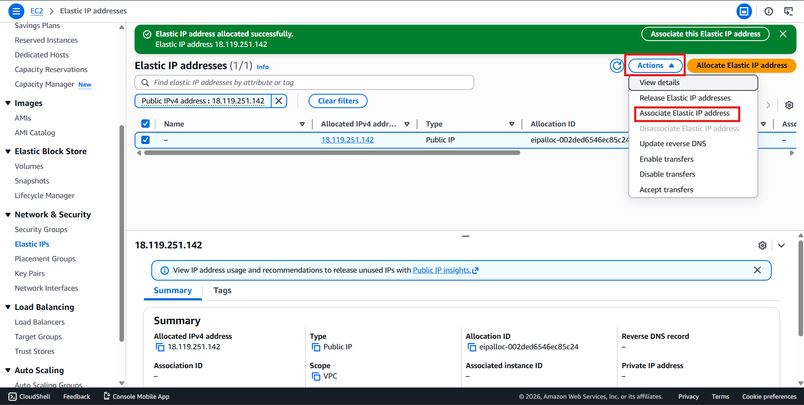

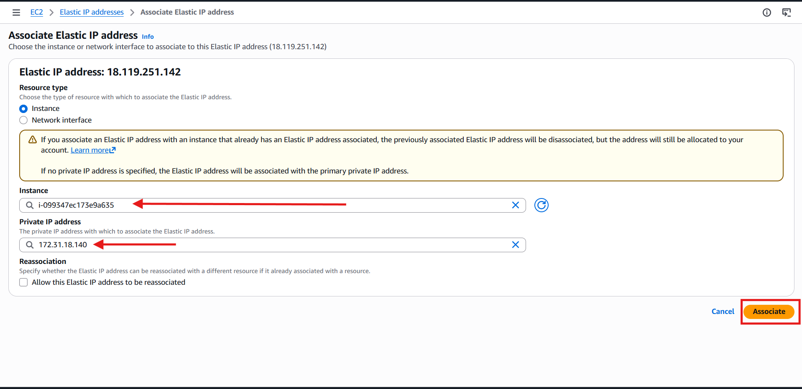

- The **DNS** propagation delay from Network Solution will take roughly 24 - 48 hours to take fully effect and is time wasting so i used **Route 53** in **AWS** because it propagates in minutes ⚡

- Create Hosted Zone in Route 53

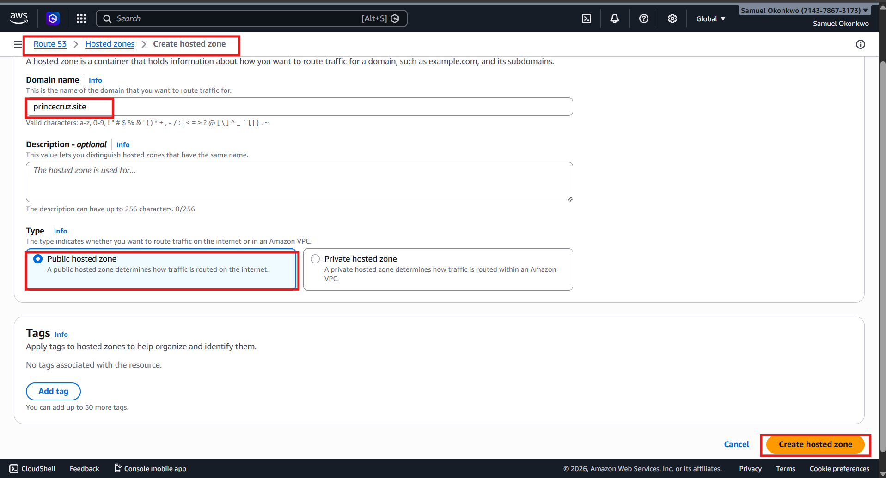

- Create 2 A-Record and add your elastic IP in the Value option just as seen in the image below

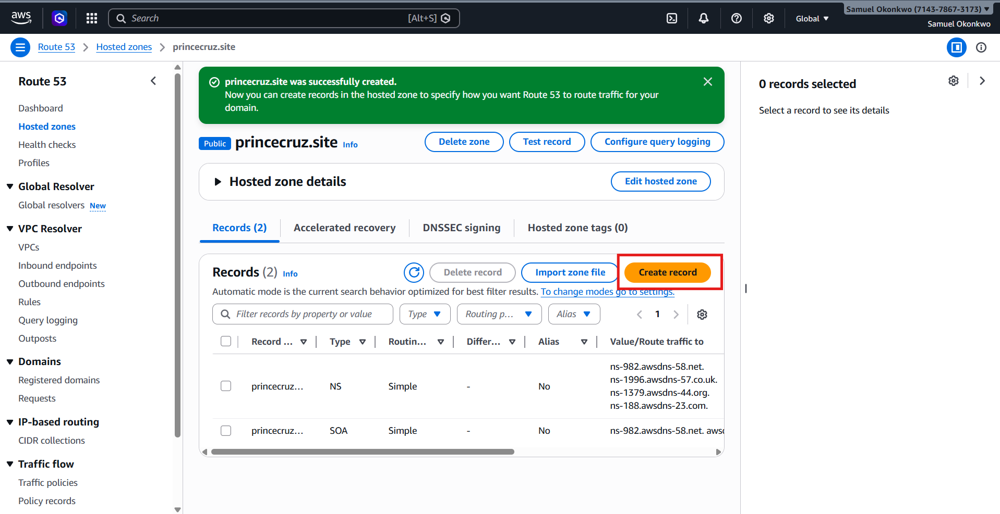

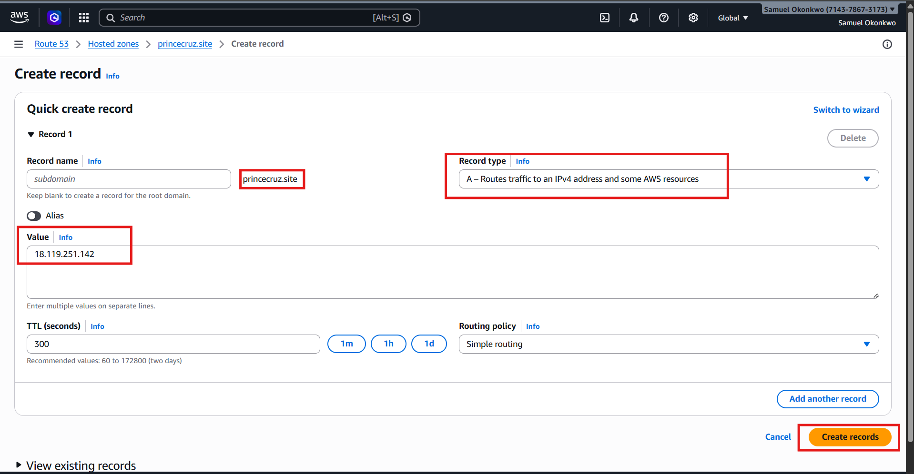

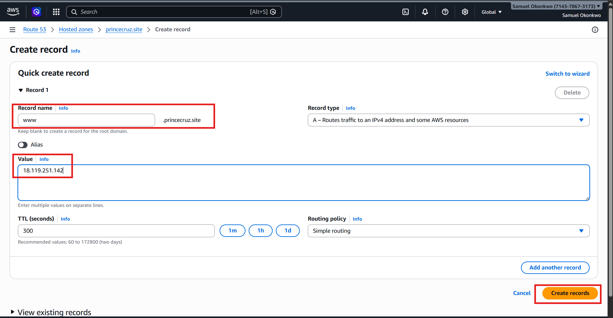

- Replace Nameservers in your DNS to that of your Route 53.

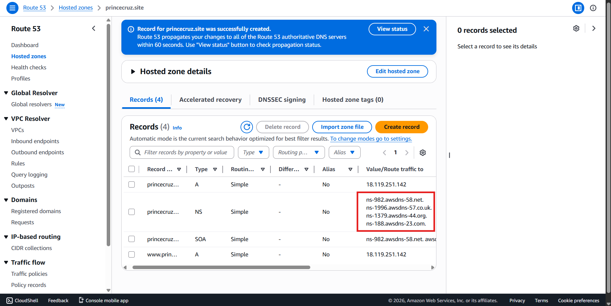

- Confirm if it worked by running this command:
``nslookup princecruz.site``

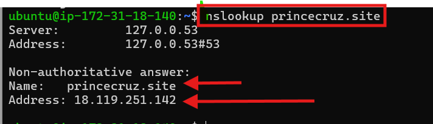

- Update Nginx Config and set your server_name : ``sudo vi /etc/nginx/nginx.conf``

- ``sudo nginx -t``   ``sudo systemctl restart nginx``

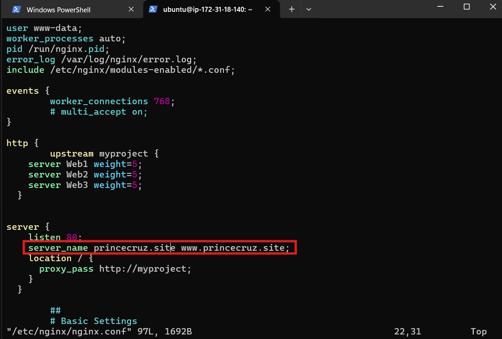

- Install snapd if not installed before:
```
sudo apt update
sudo apt install snapd -y
sudo systemctl enable snapd
sudo systemctl start snapd
sudo systemctl status snapd
```
- Install Cerbot:
```
sudo snap install --classic certbot
sudo ln -s /snap/bin/certbot /usr/bin/certbot
```

- Get SSL Certificate: 
``sudo certbot --nginx``

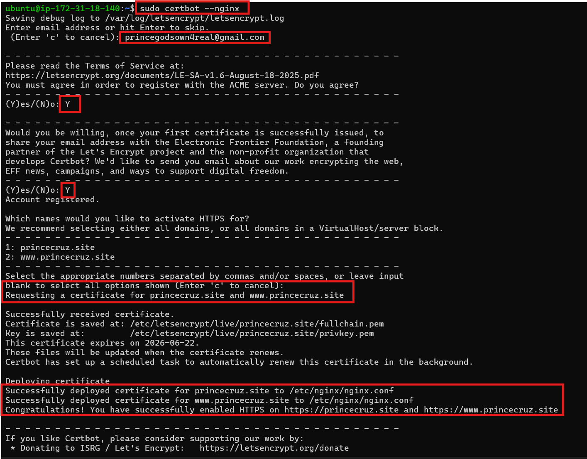

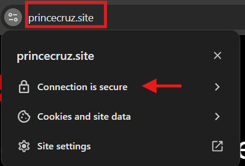

- Set up periodical renewal of your SSL/TLS certificate

- By default, LetsEncrypt certificate is valid for 90 days, so it is recommended to renew it at least every 60 days or more frequently.

- You can test renewal command in dry-run mode : 
``sudo certbot renew --dry-run``

- Best pracice is to have a scheduled job that to run renew command periodically. Let us configure a cronjob to run the command twice a day.
To do so, lets edit the crontab file with the following command:
``crontab -e``

- Add following line:
``* */12 * * *   root /usr/bin/certbot renew > /dev/null 2>&1``

- You can always change the interval of this cronjob if twice a day is too often by adjusting schedule expression.

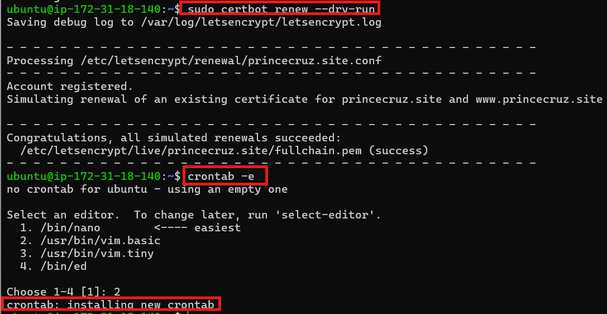

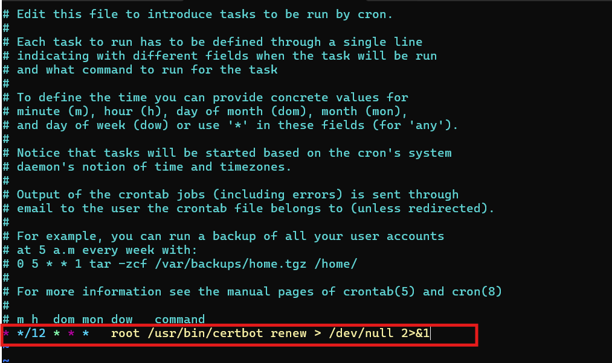


