## **WEB STACK IMPLEMENTATION (LEMP STACK)**

This document describes the steps used to implement LAMP STACK on an AWS EC2 instance. The screenshots taken during the process are included below in the order they were used to perform the setup.

*- Preparing prerequisites*

- I already have an AWS Acccount i use but if you don't please create one while is neccessary for this project.

- Create an EC2 instance of t2.micro family with Ubuntu Server 22.04 LTS (HVM) image.
-  Make sure you also create a KEY PAIR or use the previous one you created for the Task 1, You can leave the rest settings as default

   

   

   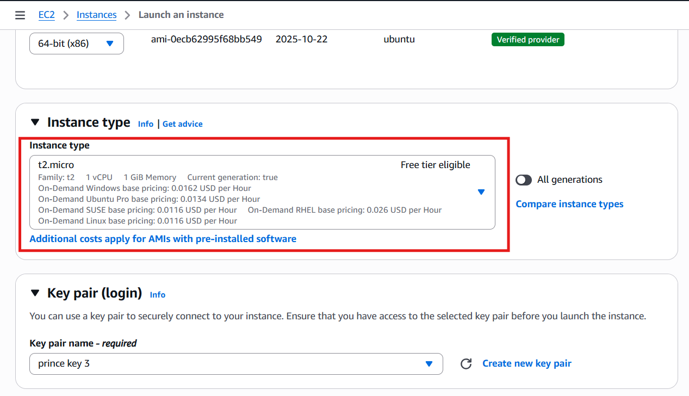


**STEP 1 – INSTALLING THE NGINX WEB SERVER**
- To make our website available for people to view, we will use Nginx, which is a fast web server. We will install it using ```apt```, a tool that helps manage and install software on the server. Since this is the first time we are using ```apt``` in this session, we need to update the server so it has the latest list of available software by running the command ```sudo apt update``` 

  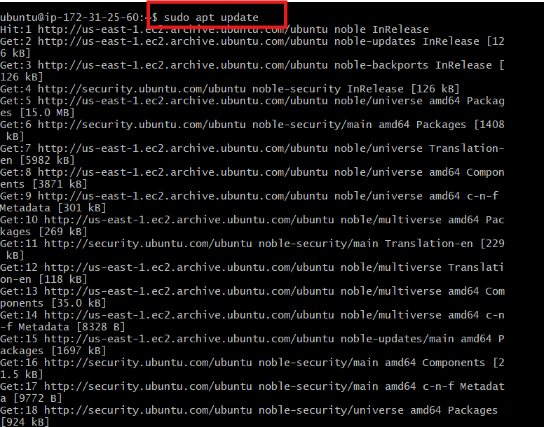
  

- After updating, we can then install Nginx using the following commands below:

  ```sudo apt install nginx```

   When prompted, enter Y to confirm that you want to install Nginx. Once the installation is finished, the Nginx web server will be active and running on your Ubuntu 20.04 server.

  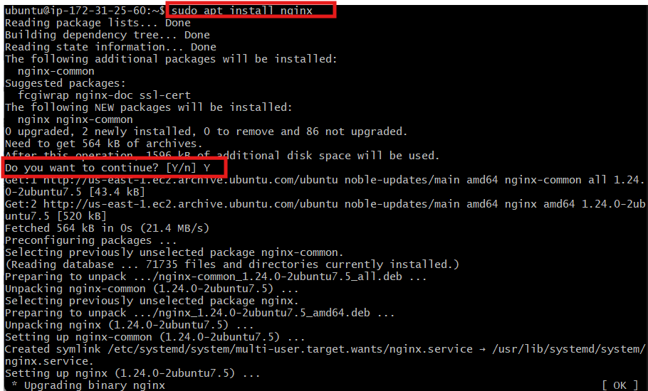

- To verify that **nginx** was successfully installed and is running as a service in Ubuntu and If it is green and running, then you did everything correctly, run the command below:

   ```sudo systemctl status nginx```

  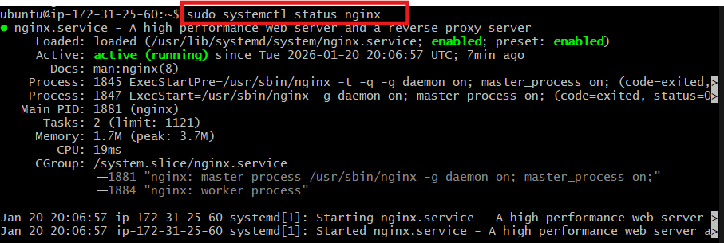

- Before we can receive any traffic by our Web Server, we need to open **TCP port 80** which is default port that web browsers use to access web pages in the Internet. Check out task 1 to see how to enable **TCP port 80**
- Now it is time for us to test how our **Nginx** server can respond to requests from the Internet after opening TCP port 80. 

- Open a web browser of your choice and try to access following url: 

   http://Public-IP-Address:80

  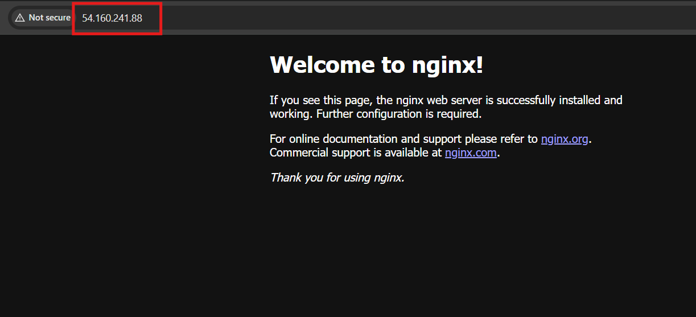

- if you see something like the image above then you are correct. 

**STEP 2 — INSTALLING MYSQL**

- Again, use ```apt``` to acquire and install this software and When prompted, confirm installation by typing Y, and then ENTER.

   ```sudo apt install mysql-server```

   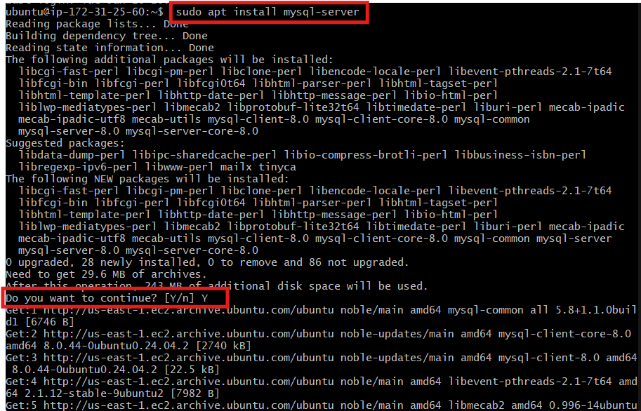

- When the installation is finished, log in to the MySQL console by typing the command: 

    ```sudo mysql```

    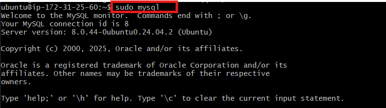
   
- Define the users password by running this command below while you are still log in to **Mysql**

   ```ALTER USER 'root'@'localhost' IDENTIFIED WITH mysql_native_password BY 'PassWord.1';```

- Exit the **Mysql** shell after pasting the command above by typing ```Exit```
- Start the interactive script by running:

   ```sudo mysql_secure_installation```

   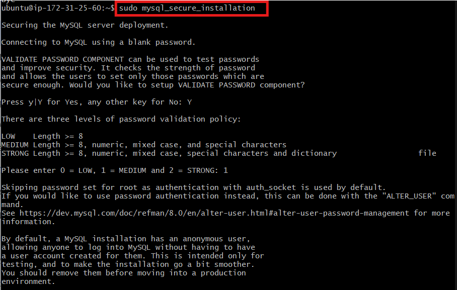
- For the rest of the questions, press Y and hit the ENTER key at each prompt.
- When you’re finished, test if you’re able to log in to the MySQL console by typing the command below, make sure you type in your password before **mysql** can be log in, after confirming, type ```exit``` and hit **ENTER** to log out of **mysql**

   ```sudo mysql -p```

   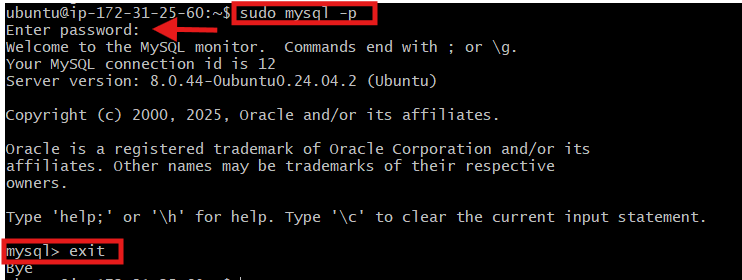

**STEP 3 – INSTALLING PHP**

- You already have Nginx, which is the part of your server that shows web pages to visitors, and MySQL, which is where your website stores information like users, passwords, posts, or products.

- Now you want your website to be dynamic, not just plain pages. That’s where PHP comes in. PHP is the language that does the thinking, it decides what content to show, processes forms, and talks to the database.
- You’ll need to install **php-fpm**, which stands for “**PHP fastCGI process manager**”, and tell Nginx to pass PHP requests to this software for processing. Additionally, you’ll need **php-mysql**, a PHP module that allows PHP to communicate with MySQL-based databases. Core PHP packages will automatically be installed as dependencies.
- To install these 2 packages at once, run:

  ```sudo apt install php-fpm php-mysql```
-  When prompted, type Y and press ENTER to confirm installation
  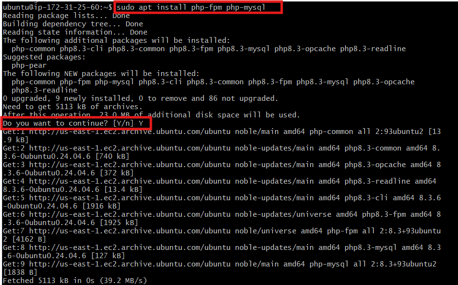
        You now have your PHP components installed.

**STEP 4 — CONFIGURING NGINX TO USE PHP PROCESSOR**

- When you use Nginx, you can set it up so one server can host multiple domain at the same time.
To do this, Nginx uses something called server blocks.  In this guide, we will use **ProjectFLOW** as an example domain name.

- Create the root web directory for your domain as follows:

   ```sudo mkdir /var/www/ProjectFLOW```
- Next, assign ownership of the directory with the $USER environment variable, which will reference your current system user:

   ```sudo chown -R $USER:$USER /var/www/ProjectFLOW```

- Then, open a new configuration file in **Nginx’s sites-available** directory using your preferred command-line editor. Here, we’ll use **nano**:

  ```sudo nano /etc/nginx/sites-available/ProjectFLOW```

- This will create a new blank file. Paste in the following bare-bones configuration:
```
server {
	listen 80;
	server_name projectLEMP www.projectLEMP;
	root /var/www/projectLEMP;
 
	index index.html index.htm index.php;
 
	location / {
    	try_files $uri $uri/ =404;
	}
 
	location ~ \.php$ {
    	include snippets/fastcgi-php.conf;
    	fastcgi_pass unix:/var/run/php/php8.1-fpm.sock;
 	}
 
	location ~ /\.ht {
    	deny all;
	}
 
}
```
   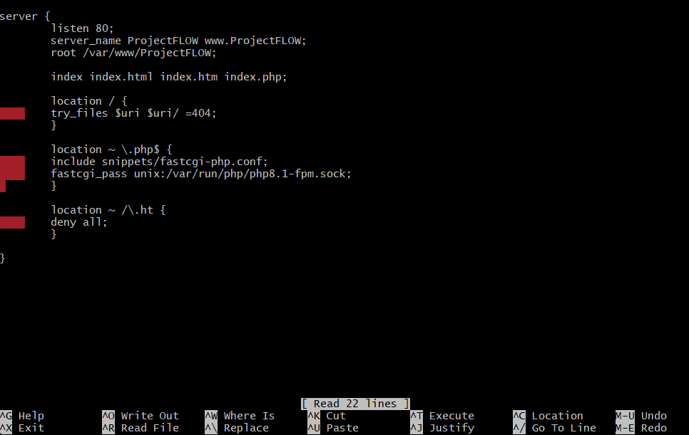
- When you’re done editing, save and close the file. If you’re using nano, you can do so by typing **CTRL+X** and then **y** and **ENTER** to confirm.


- **Here’s what each of these directives and location blocks do:**

- **listen** — Defines what port Nginx will listen on. In this case, it will listen on port **80**, the default port for HTTP.
- **root** — Defines the document root where the files served by this website are stored.
- **index** — Defines in which order Nginx will prioritize index files for this website. It is a common practice to list **index.html** files with a higher precedence than **index.php** files to allow for quickly setting up a maintenance landing page in PHP applications. You can adjust these settings to better suit your application needs.
- **server_name** — Defines which domain names and/or IP addresses this server block should respond for. **Point this directive to your server’s domain name or public IP address**.
- **location /** — The first location block includes a **try_files** directive, which checks for the existence of files or directories matching a URI request. If Nginx cannot find the appropriate resource, it will return a 404 error.
- **location ~ \ .php$** — This location block handles the actual PHP processing by pointing Nginx to the fastcgi-php.conf configuration file and the **php7.4-fpm.sock file**, which declares what socket is associated with **php-fpm**
- **location ~ /\ .ht** — The last location block deals with **htaccess** files, which Nginx does not process. By adding the deny all directive, if any **htaccess** files happen to find their way into the document root, they will not be served to visitors.

- Activate your configuration by linking to the config file from Nginx’s sites-enabled directory:

  ```sudo ln -s /etc/nginx/sites-available/ProjectFLOW /etc/nginx/sites-enabled/```

- This will tell Nginx to use the configuration next time it is reloaded. You can test your configuration for syntax errors by typing:

   ```sudo nginx -t```
- You shall see following message:
```
nginx: the configuration file /etc/nginx/nginx.conf syntax is ok
nginx: configuration file /etc/nginx/nginx.conf test is successful
```
- We also need to disable default Nginx host that is currently configured to listen on port 80, for this run:

  ```sudo unlink /etc/nginx/sites-enabled/default```
- When you are ready, reload Nginx to apply the changes:

   ```sudo systemctl reload nginx```

- Your new website is now active, but the web root /var/www/ProjectFLOW is still empty. Create an index.html file in that location so that we can test that your new server block works as expected:

  ```sudo echo 'Hello FLOW from hostname' $(curl -s http://169.254.169.254/latest/meta-data/public-hostname) 'with public IP' $(curl -s http://169.254.169.254/latest/meta-data/public-ipv4) > /var/www/ProjectFLOW/index.html```

- Now go to your browser and try to open your website URL using IP address:

  ```http://<Public-IP-Address>:80```

  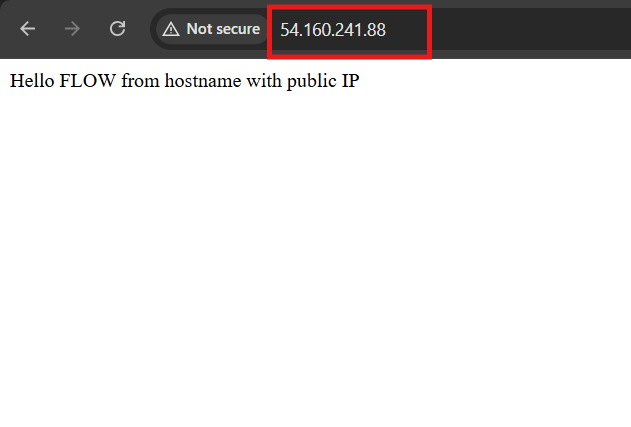


**STEP 5 – TESTING PHP WITH NGINX**

- At this point, your LAMP stack is completely installed and fully operational.

- You can test it to validate that Nginx can correctly hand **php** files off to your PHP processor.

- You can do this by creating a test PHP file in your document root. Open a new file called **info.php** within your document root in your text editor:

  ```sudo nano /var/www/ProjectFLOW/info.php```

- Type or paste the following lines into the new file. This is valid PHP code that will return information about your server:
```
<?php
phpinfo();
```


- You can now access this page in your web browser by visiting the domain name or public IP address you’ve set up in your Nginx configuration file, followed by /info.php:

- http://PublicIPAddress/info.php

- You will see a web page containing detailed information about your server:

  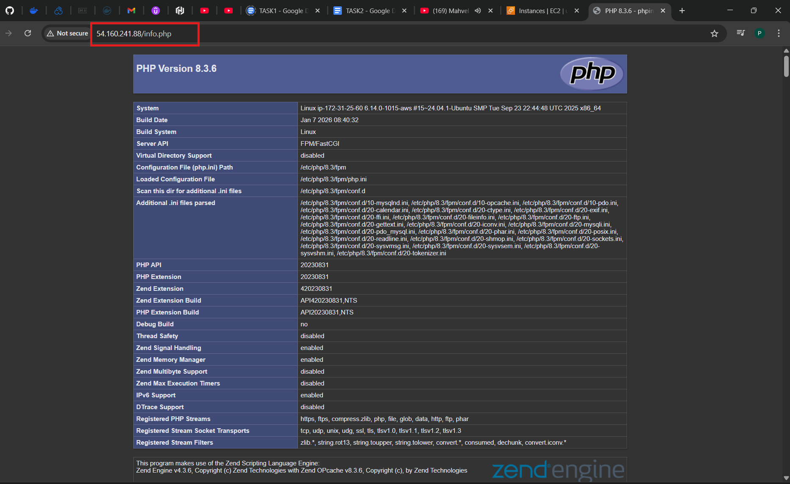

- After checking the relevant information about your PHP server through that page, it’s best to remove the file you created as it contains sensitive information about your PHP environment and your Ubuntu server. You can use rm to remove that file:

  ```sudo rm /var/www/your_domain/info.php```


**STEP 6 – RETRIEVING DATA FROM MYSQL DATABASE WITH PHP**

- In this step you will create a test database (DB) with simple "To do list" and configure access to it, so the Nginx website would be able to query data from the DB and display it.
- At the time of this writing, the native MySQL PHP library mysqlnd doesn’t support  ```caching_sha2_authentication```, the default authentication method for MySQL 8. We’ll need to create a new user with the ```mysql_native_password``` authentication method in order to be able to connect to the MySQL database from PHP.
- We will create a database named **example_database** and a user named **example_user**, but you can replace these names with different values.

- First, connect to the MySQL console using the root account:

   ```sudo mysql```
- To create a new database, run the following command from your MySQL console:


    ```mysql> CREATE DATABASE `example_database`;```
   
  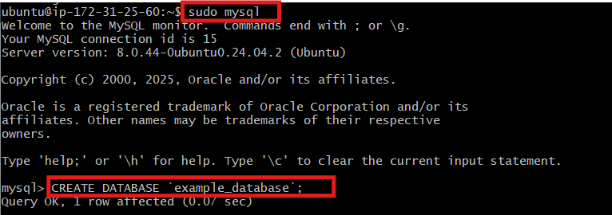
- Now you can create a new user and grant him full privileges on the database you have just created.

  ```mysql> CREATE USER 'example_user'@'%' IDENTIFIED WITH mysql_native_password BY 'password';```
- Now we need to give this user permission over the example_database database:

   ```mysql> GRANT ALL ON example_database.* TO 'example_user'@'%';```

- Now exit the MySQL shell with:

    ```mysql> exit```

  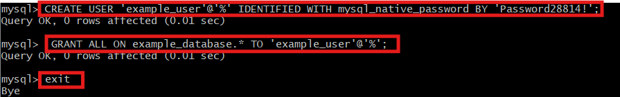

- You can test if the new user has the proper permissions by logging in to the MySQL console again, this time using the custom user credentials:

    ```mysql -u example_user -p```
- After logging in to the MySQL console, confirm that you have access to the example_database database:

    ```mysql> SHOW DATABASES;```

  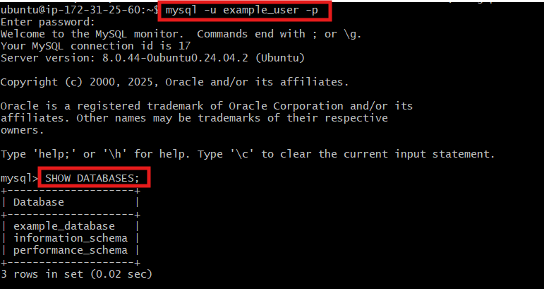

- Next, we’ll create a test table named todo_list. From the MySQL console, run the following statement:

```
CREATE TABLE todo_list (
    item_id INT AUTO_INCREMENT,
    content VARCHAR(255),
    PRIMARY KEY(item_id)
);
```
- Insert a few rows of content in the test table. You might want to repeat the next command a few times, using different VALUES:

  ``` INSERT INTO example_database.todo_list (content) VALUES ("My first important item");```

- To confirm that the data was successfully saved to your table, run:

   ```SELECT * FROM example_database.todo_list;```

  
- After confirming that you have valid data in your test table, you can exit the MySQL console:

    ```mysql> exit```
- Now you can create a PHP script that will connect to MySQL and query for your content. Create a new PHP file in your custom web root directory using your preferred editor. We’ll use vi for that:

  ```nano /var/www/ProjectFLOW/todo_list.php```
- Copy this content into your todo_list.php script, Save and close the file when you are done editing.
```
<?php
$user = "example_user";
$password = "password";
$database = "example_database";
$table = "todo_list";
 
try {
  $db = new PDO("mysql:host=localhost;dbname=$database", $user, $password);
  echo "<h2>TODO</h2><ol>";
  foreach($db->query("SELECT content FROM $table") as $row) {
	echo "<li>" . $row['content'] . "</li>";
  }
  echo "</ol>";
} catch (PDOException $e) {
	print "Error!: " . $e->getMessage() . "<br/>";
	die();
}
```
- You can now access this page in your web browser by visiting the domain name or public IP address configured for your website, followed by /todo_list.php:

- http://PublicIPaddress/todo_list.php

  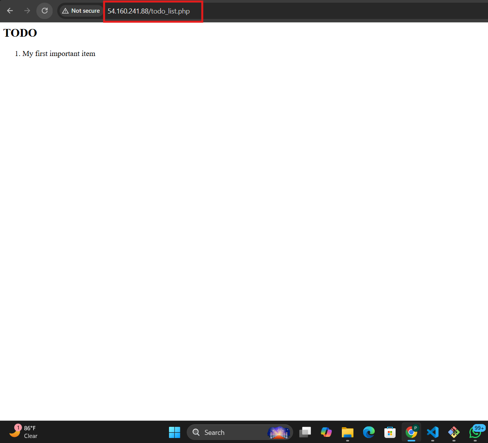

**TROUBLESHOOT:**
- I had issue accessing the Todo_list.php
because MYSQL password i set for **example_user** is different from what is in my todo_list.php, so i had to locate my project file, after that i run this command on my terminal

    ```cd /var/www/ProjectFLOW``` 
    
    ```ls``` to see whats inside my project which where **index.html** and 
**todo_list.php**
so i ran this command so i can be able to edit my **todo_list.php**

   ```nano todo_list.php```


```
$user = "example_user";
$password = "password";   (<-- THIS was my issue)
$database = "example_database";
```
- so i corrected the password and the content below was my new content in my todo_list.php script:

```
<?php
$user = "example_user";
$password = "Password28814!";   // your actual MySQL password
$database = "example_database";
$table = "todo_list";

try {
    // Force TCP connection instead of UNIX socket
    $db = new PDO("mysql:host=127.0.0.1;dbname=$database;charset=utf8mb4", $user, $password);

    // Set PDO to throw exceptions on errors
    $db->setAttribute(PDO::ATTR_ERRMODE, PDO::ERRMODE_EXCEPTION);

    echo "<h2>TODO</h2><ol>";

    foreach($db->query("SELECT content FROM $table") as $row) {
        echo "<li>" . htmlspecialchars($row['content']) . "</li>";
    }

    echo "</ol>";
} catch (PDOException $e) {
    // Show detailed error
    echo "Database connection error: " . $e->getMessage();
    die();
}
```
- after this i was able to access my todo_list.php from my broswer using my public IP. 


