## **MEAN STACK DEPLOYMENT TO UBUNTU IN AWS**
- **<u>MEAN Stack is a combination of the following components</u>:**

- **MongoDB** (Document database) – Stores and allows retrieval of data.
- **Express** (Back-end application framework) – Makes requests to Database for Reads and Writes.
- **Angular** (Front-end application framework) – Handles Client and Server Requests
- **Node.js** (JavaScript runtime environment) – Accepts requests and displays results to end user

- **<u> Preparing prerequisites</u>**

- Create an EC2 instance of t2.micro family with Ubuntu Server 22.04 LTS (HVM) image.

- Make sure you also create a KEY PAIR and You can leave the rest settings as default and also get familair on how configure inbound rules for security groups using the AWS console.

- **MAIN PURPOSE FOR THIS TASK IS TO IMPLEMENT A SIMPLE BOOK REGISTER WEB FROM USING MEAN STACK**

**STEP 1:  INSTALL  NODEJS**

- Update Ubuntu: ```sudo apt update```

- Upgrade ubunt: ```sudo apt upgrade```

- Add Certificate 

   ```sudo apt -y install curl dirmngr apt-transport-https lsb-release ca-certificates```

   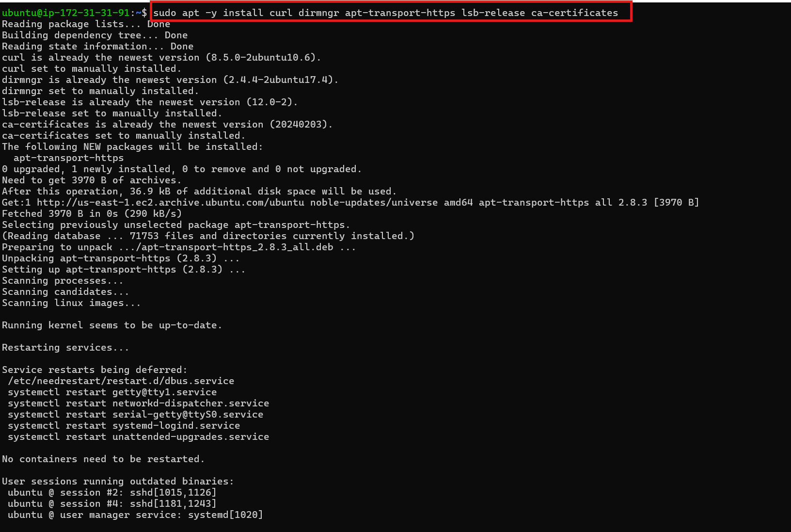

**NOTE:** The Certificate command installs important system tools that help your server download and verify software securely and it is often run before setup scripts.

- Run this:

    ```curl -fsSL https://deb.nodesource.com/setup_20.x | sudo -E bash -```

    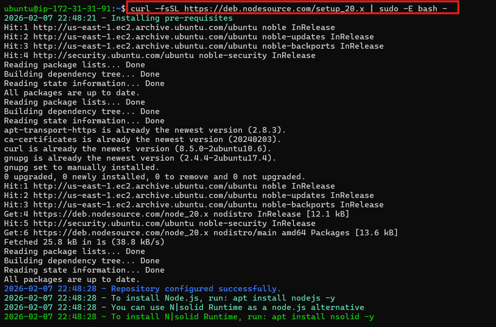

**NOTE:** This command:

- Downloads a setup script from NodeSource, Runs it as administrator, Adds Node.js 20 repository to Ubuntu, Prepares your system to install Node.js 20. So after running it, you can install Node.js 20


- Install Nodejs to the lastest version by running the command below:

   ```sudo apt install -y nodejs```

    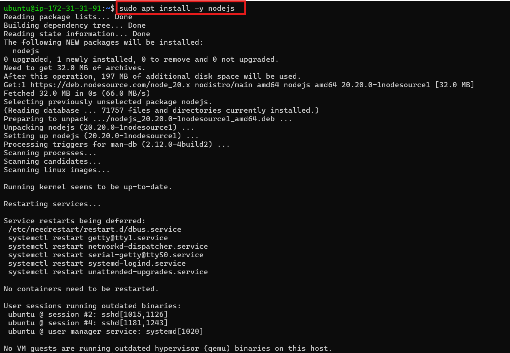

- Verify installation by running: 

   ```nodejs -v && npm -v```

   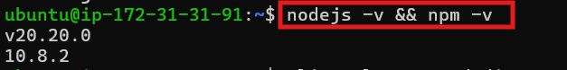


- **STEP 2: INSTALL MONGODB**


**NOTE:** The version of MONGODB in the task 4 project is old so these are the updated version and run the command below accordingly 

- Install Required Tools by running the command below:

   ```sudo apt update```
    ```sudo apt install -y curl gnupg ca-certificates```

   

- Add MongoDB Official Key (Modern Way)

   ```curl -fsSL https://pgp.mongodb.com/server-7.0.asc | sudo gpg --dearmor -o /usr/share/keyrings/mongodb-server-7.0.gpg```

- Add MongoDB Repo (Jammy = Compatible with 24.04)

    ```echo "deb [ arch=amd64,arm64 signed-by=/usr/share/keyrings/mongodb-server-7.0.gpg ] https://repo.mongodb.org/apt/ubuntu jammy/mongodb-org/7.0 multiverse" | sudo tee /etc/apt/sources.list.d/mongodb-org-7.0.list```

   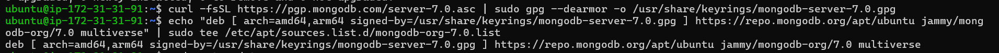

- Update Package List:
 
   ```sudo apt update```

   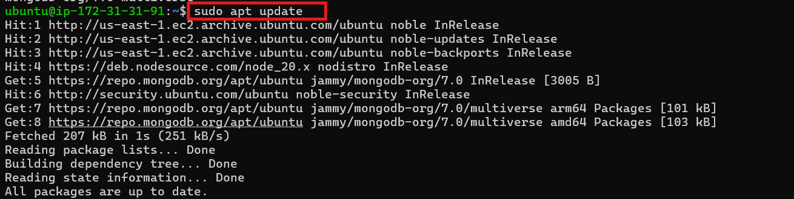

 - Install MongoDB:

   ```sudo apt install -y mongodb```

   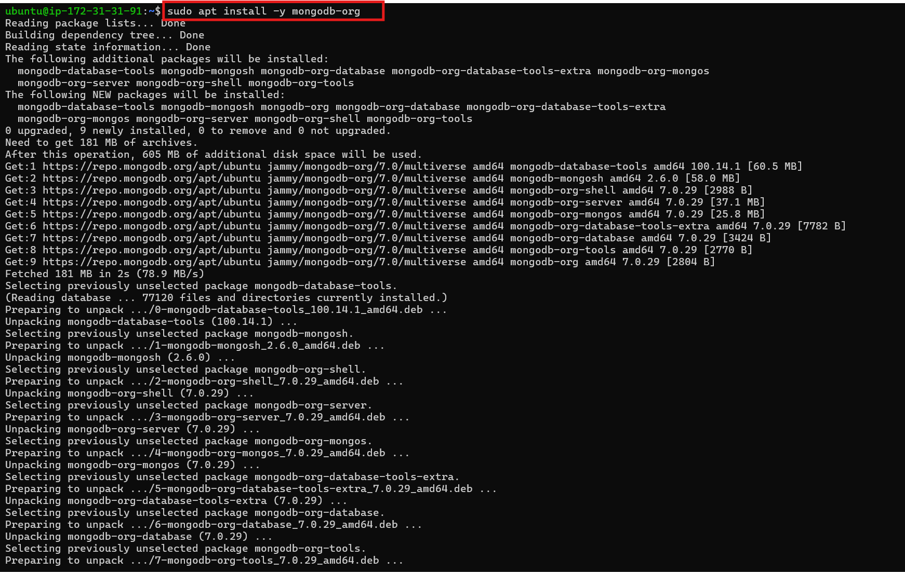

- Start & Enable MongoDB:

   ```sudo systemctl start mongod```

   ```sudo systemctl enable mongod```

    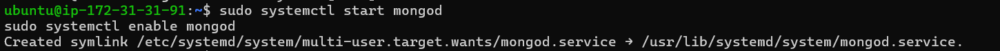

- Check Status (You should see **ACTIVE (RUNNING)** ) :

    ```sudo systemctl status mongod```

   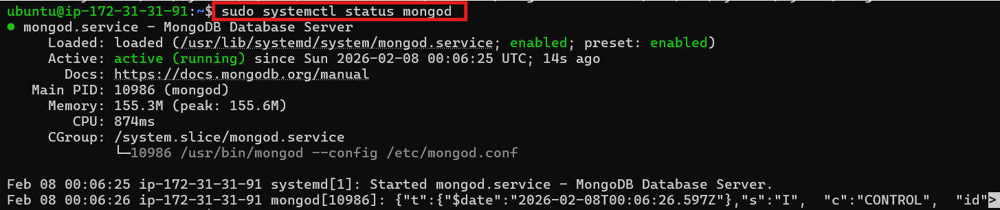

- Test It (If it opens then MongoDB is ready) and press ```exit``` :

  ```mongosh```

   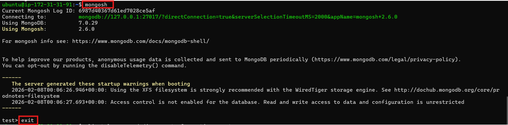

- Install **npm** – Node package manager:

   ```sudo apt install -y npm```

-  Check Your Versions:

   ```node -v && npm -v```
  
     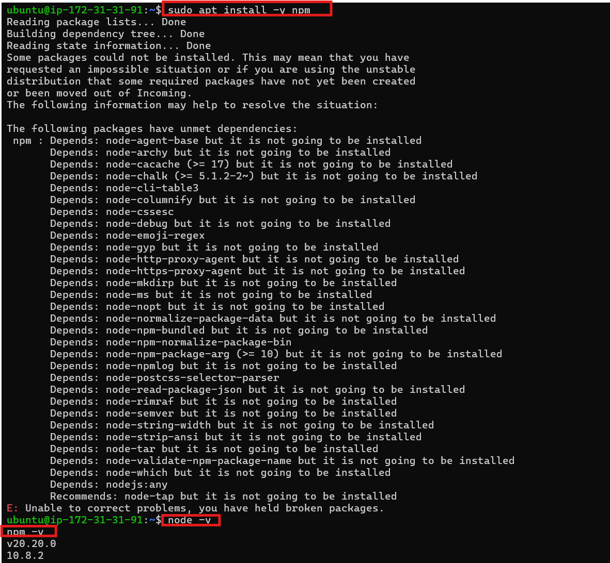
     

- Install **body-parser** package. 
We need ‘body-parser’ package to help us process JSON files passed in requests to the server:

   ```sudo npm install body-parser```

   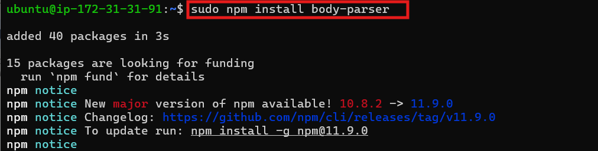

- Create a folder named ‘Books’ :

   ```mkdir Books && cd Books```

- In the Books directory, Initialize npm project :

   ```npm init```

    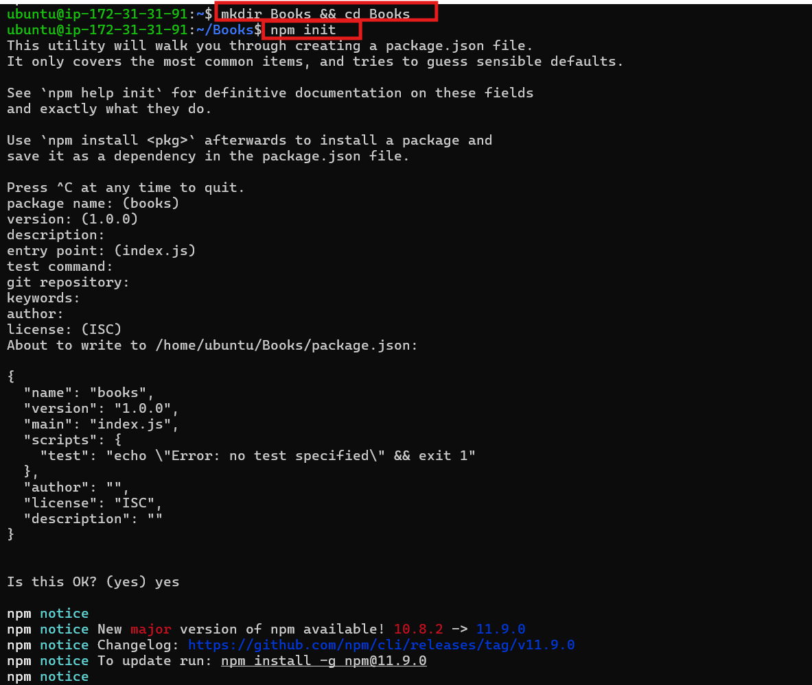

- Add a file to it named **server.js**

  ```nano server.js```

- Copy and paste the web server code below into the server.js file.

```
var express = require('express');
var bodyParser = require('body-parser');
var app = express();
app.use(express.static(__dirname + '/public'));
app.use(bodyParser.json());
require('./apps/routes')(app);
app.set('port', 3300);
app.listen(app.get('port'), function() {
    console.log('Server up: http://localhost:' + app.get('port'));
});
```
  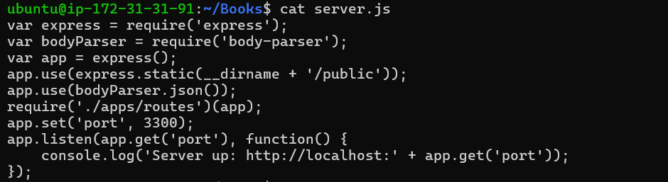


- **STEP 3: INSTALL EXPRESS AND SET UP ROUTES**

- Express is a minimal and flexible ```Node.js``` web application framework that provides features for web and mobile applications. We will use Express to pass book information to and from our MongoDB database.

- We also will use ```Mongoose``` package which provides a straightforward, schema-based solution to model your application data. We will use Mongoose to establish a schema for the database to store data of our book register.

- In your Book directory run this command:

   ```sudo npm install express mongoose```

   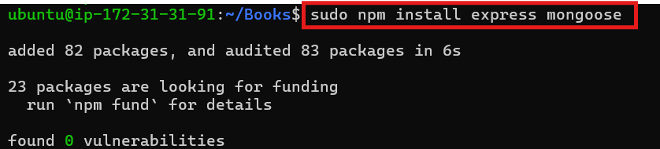

- In **Books** folder, create a folder named **apps**

  ```mkdir apps && cd apps```

- Create a file named **routes.js**

    ```nano routes.js```

- Copy and paste the code below into **routes.js**
```
var Book = require('./models/book');

module.exports = function (app) {

  // Get all books
  app.get('/book', async function (req, res) {
    try {
      const result = await Book.find({});
      res.json(result);
    } catch (err) {
      res.status(500).json({ error: err.message });
    }
  });

  // Add new book
  app.post('/book', async function (req, res) {
    try {

      const book = new Book({
        name: req.body.name,
        isbn: req.body.isbn,
        author: req.body.author,
        pages: req.body.pages
      });

      const result = await book.save();

      res.json({
        message: "Successfully added book",
        book: result
      });

    } catch (err) {
      res.status(500).json({ error: err.message });
    }
  });

  // Delete book
  app.delete('/book/:isbn', async function (req, res) {
    try {

      const result = await Book.findOneAndDelete({
        isbn: req.params.isbn
      });

      if (!result) {
        return res.status(404).json({
          message: "Book not found"
        });
      }

      res.json({
        message: "Successfully deleted the book",
        book: result
      });

    } catch (err) {
      res.status(500).json({ error: err.message });
    }
  });

  // Catch all routes
  app.all(/.*/, function (req, res) {
    res.status(404).json({ message: "Route not found" });
  });

};
```

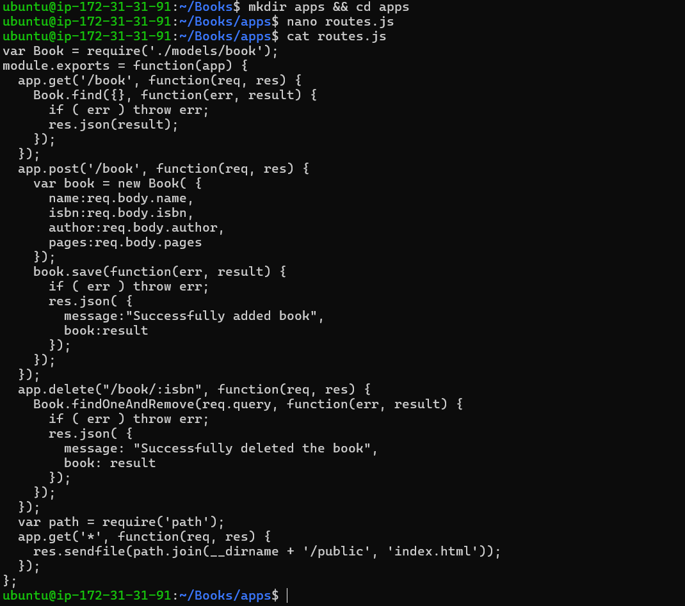


- In the **apps** folder, create a folder named **models**

  ```mkdir models && cd models```

- Create a file named **book.js**

   ```nano book.js```

- Copy and paste the code below into ```book.js```

```
var mongoose = require('mongoose');
var dbHost = 'mongodb://localhost:27017/test';
mongoose.connect(dbHost);
mongoose.connection;
mongoose.set('debug', true);
var bookSchema = mongoose.Schema( {
  name: String,
  isbn: {type: String, index: true},
  author: String,
  pages: Number
});
var Book = mongoose.model('Book', bookSchema);
module.exports = mongoose.model('Book', bookSchema);
```
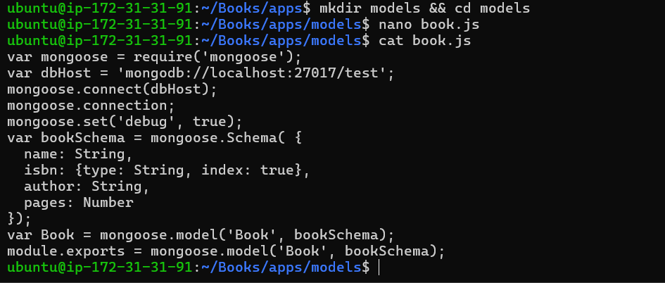


**STEP 4 – ACCESS THE ROUTES WITH ANGULARJS**

- **AngularJS provides a web framework for creating dynamic views in your web applications.** In this tutorial, we use AngularJS to connect our web page with Express and perform actions on our book register.

- Change the directory back to ‘Books’

   ```cd ../..```
- Create a folder named **public** :

   ```mkdir public && cd public```

- Add a file named **script.js** and copy and paste the code below in it :

     ```nano script.js```
```
var app = angular.module('myApp', []);
app.controller('myCtrl', function($scope, $http) {
  $http( {
    method: 'GET',
    url: '/book'
  }).then(function successCallback(response) {
    $scope.books = response.data;
  }, function errorCallback(response) {
    console.log('Error: ' + response);
  });
  $scope.del_book = function(book) {
    $http( {
      method: 'DELETE',
      url: '/book/:isbn',
      params: {'isbn': book.isbn}
    }).then(function successCallback(response) {
      console.log(response);
    }, function errorCallback(response) {
      console.log('Error: ' + response);
    });
  };
  $scope.add_book = function() {
    var body = '{ "name": "' + $scope.Name + 
    '", "isbn": "' + $scope.Isbn +
    '", "author": "' + $scope.Author + 
    '", "pages": "' + $scope.Pages + '" }';
    $http({
      method: 'POST',
      url: '/book',
      data: body
    }).then(function successCallback(response) {
      console.log(response);
    }, function errorCallback(response) {
      console.log('Error: ' + response);
    });
  };
});
```
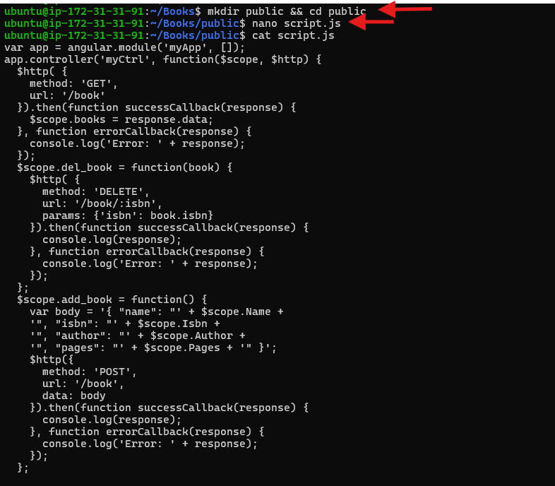


- In the **public** folder, create a file named **index.html** and paste the code below in it :

    ```nano index.html```
```
<!doctype html>
<html ng-app="myApp" ng-controller="myCtrl">
  <head>
    <script src="https://ajax.googleapis.com/ajax/libs/angularjs/1.6.4/angular.min.js"></script>
    <script src="script.js"></script>
  </head>
  <body>
    <div>
      <table>
        <tr>
          <td>Name:</td>
          <td><input type="text" ng-model="Name"></td>
        </tr>
        <tr>
          <td>Isbn:</td>
          <td><input type="text" ng-model="Isbn"></td>
        </tr>
        <tr>
          <td>Author:</td>
          <td><input type="text" ng-model="Author"></td>
        </tr>
        <tr>
          <td>Pages:</td>
          <td><input type="number" ng-model="Pages"></td>
        </tr>
      </table>
      <button ng-click="add_book()">Add</button>
    </div>
    <hr>
    <div>
      <table>
        <tr>
          <th>Name</th>
          <th>Isbn</th>
          <th>Author</th>
          <th>Pages</th>
 
        </tr>
        <tr ng-repeat="book in books">
          <td>{{book.name}}</td>
          <td>{{book.isbn}}</td>
          <td>{{book.author}}</td>
          <td>{{book.pages}}</td>
 
          <td><input type="button" value="Delete" data-ng-click="del_book(book)"></td>
        </tr>
      </table>
    </div>
  </body>
</html>
```


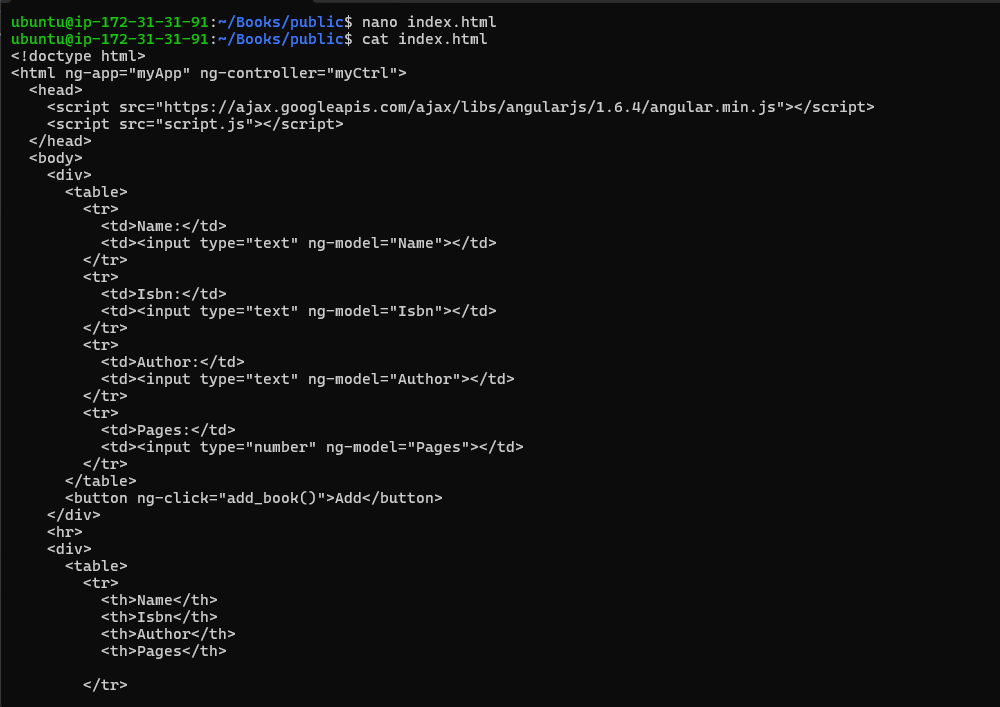

- Change the directory back up to **Books**

    ```cd ..```

- Start the server by running this command:

   ```node server.js```

  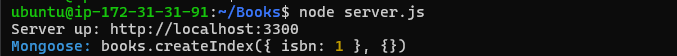

-  You need to open TCP port 3300 in your AWS Web Console for your EC2 Instance to view your Book register web application from the internrt with your broswer using your Public IP. 

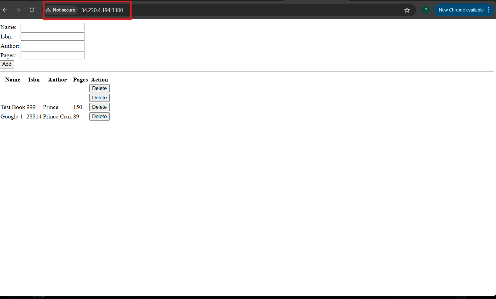


